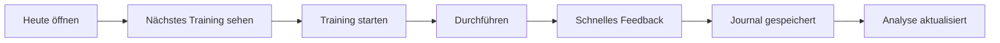

# Paddlio One - Workflow-Review

Stand: Development, Branch `develop`

## Gesamtbewertung Workflow

Workflow Kalender + Training aktuell: **6,5 / 10**

Paddlio hat die richtigen Funktionsbausteine. Die größte Schwäche ist nicht fehlende Funktionalität, sondern fehlende Führung zwischen den Bausteinen. Der Nutzer muss noch zu oft wissen, wo etwas liegt.

## Ziel-Workflow Trainer

```mermaid
flowchart LR
  A["Woche öffnen"] --> B["Vorlage auswählen"]
  B --> C["In Kalender ziehen"]
  C --> D["Quick Edit: Zeit, Gruppe, Trainer"]
  D --> E["Konflikte prüfen"]
  E --> F["Speichern"]
  F --> G["Individuelle Anpassungen"]
  G --> H["Traineraufgaben"]
  H --> I["Training durchführen"]
  I --> J["Feedback und Anwesenheit prüfen"]
  J --> K["Soll/Ist auswerten"]
```

## Ziel-Workflow Sportler

## Aktueller Workflow

| Aufgabe | Aktueller Ablauf | Problem |
|---|---|---|
| Training planen | Training -> Plan -> Formular | funktionsreich, aber schwer |
| Vorlage verwenden | Kalender oder Planbereich | nicht eindeutig genug |
| Woche kopieren | Planbereich | gut, aber zu versteckt |
| Training starten | Übersicht -> Status | kein echter Durchführungsmodus |
| Feedback geben | Übersicht oder Training | zu viele Felder auf einmal |
| Journal prüfen | eigener Bereich | gut, aber wenig Filter |
| Traineraufgabe erstellen | Plan -> Training -> Aufgabe | vorhanden, aber nicht kalendernah |
| Jahresplanung | Plan/Jahr | vorbereitet, noch nicht saisonfähig |

## Kritische Reibungspunkte

### A - Zu viele Einstiegspunkte für Training

Training existiert als Übersicht, Kalender, Plan, Einheiten und Journal. Das ist fachlich richtig, aber die Benennung und Führung muss schärfer werden:

- Übersicht = Was ist jetzt wichtig?
- Kalender = Wann passiert etwas?
- Plan = Wie baue ich Trainings?
- Durchführung = Was mache ich gerade?
- Journal = Was ist tatsächlich passiert?

### A - Quick Actions fehlen an den entscheidenden Stellen

Der Nutzer sollte nicht den Bereich wechseln müssen für:

- Training bearbeiten
- kopieren
- absagen
- als Vorlage speichern
- Aufgabe anlegen
- Feedback öffnen

Diese Aktionen gehören an Trainingskarte, Kalenderblock und Detaildrawer.

### A - Rückmeldung ist nicht stark genug in den Traineralltag eingebettet

Ein Coach braucht jeden Tag:

- offene Rückmeldungen
- auffällige RPE-Werte
- fehlende Einträge
- private Kommentare
- Antwortmöglichkeit

Das sollte auf Heute, Kalender und Training sichtbar sein.

### B - Phone und Desktop brauchen unterschiedliche Wege

Phone:

- maximal 1 Hauptentscheidung pro Abschnitt
- kein schwerer Planungseditor als Standard
- Bottom Sheet für Feedback

Desktop:

- kein Vollbild für kleine Aufgaben
- Detailpanel rechts
- Aktionen inline
- Tabellen und Listen für Mengen

## Idealer Ablauf je Aufgabe

| Aufgabe | Ziel-Ablauf | Ziel-Klicks |
|---|---|---:|
| Training heute abschließen | Heute -> Durchgeführt -> RPE -> Speichern | 3 |
| Training mit Vorlage planen | Kalender -> Vorlage ziehen -> Uhrzeit bestätigen | 3 |
| Woche kopieren | Kalender -> Woche kopieren -> Zielwoche -> Speichern | 4 |
| Feedback lesen | Heute -> Rückmeldung -> Antwort | 3 |
| Traineraufgabe erstellen | Training öffnen -> Aufgabe -> Speichern | 3 |
| Plan in Journal vergleichen | Trainingdetail -> Soll/Ist | 1 |
| Wiederholung ändern | Trainingdetail -> Wiederholung -> Speichern | 3 |

## Workflow-Prioritäten

### A - Sofort verbessern

- Ein gemeinsamer Trainingdetail-Drawer.
- Schnelles Feedback als Bottom Sheet auf Phone.
- Kalender-Drop mit Quick Edit.
- Kalenderblock-Aktionen: ansehen, bearbeiten, kopieren, Aufgabe, Feedback.
- Woche kopieren als prominente Kalenderaktion.

### B - Danach

- Sichtbare Feedback-Zentrale für Trainer.
- "Heute durchführen" als eigener Modus.
- Inline-Soll/Ist im Trainingdetail.
- Bessere Termin-/Konfliktwarnungen.

### C - Später

- Automatische Tageszusammenfassung.
- KI-Wochenvorschlag.
- Saisonassistent.

