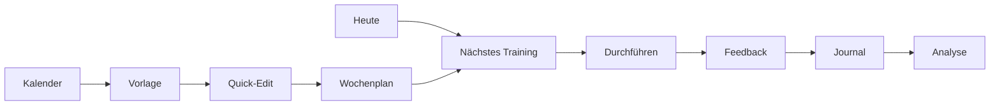

# Paddlio One - UX Review

Stand: 2026-08-04  
Branch: `develop`

## Kurzfazit

Paddlio bietet sehr viele nützliche Funktionen, aber die UX ist noch nicht überall "geführt". Besonders Trainer brauchen Geschwindigkeit: Vorlage nehmen, Woche planen, Training durchführen lassen, Feedback prüfen, Anpassung setzen. Sportler brauchen dagegen Einfachheit: Was ist heute dran, starten, fertig melden, Feedback.

UX-Bewertung: **73 / 100**

## Hauptworkflows

| Workflow | Status | Bewertung |
|---|---:|---|
| Login und Start | funktionsfähig | gut |
| Heute verstehen | vorhanden | gut, weiter fokussieren |
| Training ansehen | vorhanden | gut |
| Training starten | vorhanden | mittel, braucht stärkeren Durchführungsmodus |
| Training abschließen | vorhanden | mittel, Phone zu feldlastig |
| Feedback geben | vorhanden | gut, noch stärker an Training binden |
| Coach plant Woche | vorhanden | mittel bis gut |
| Vorlage in Kalender | vorhanden | gut, Quick-Edit weiter prüfen |
| Woche kopieren | vorhanden | gut |
| Serien löschen | verbessert, aber kritisch weiter testen | mittel |
| Polar synchronisieren | vorhanden, abhängig von externer Konfiguration | mittel |
| Team verwalten | vorhanden | mittel |
| Nachrichten nutzen | vorhanden | mittel |
| Import/Export | vorhanden | komplex, Desktop-Fokus richtig |
| Admin | vorhanden | funktional, noch nicht ruhig genug |

## Athlete-Sicht

Was gut ist:

- Phone-Fokus passt.
- Training, Feedback, Journal und Fortschritt sind vorhanden.
- Navigation ist nicht überladen.

Was stört:

- Der Weg von "geplantes Training" zu "durchgeführt" zu "Journal" sollte noch eindeutiger werden.
- Analyse und Smart Coach müssen stärker aus echten Daten erklären, warum eine Empfehlung erscheint.
- Fehlermeldungen müssen konsequent in Alltagssprache übersetzt werden.

## Coach-Sicht

Was gut ist:

- Planung, Vorlagen, Gruppen, Feedback und Aufgaben sind grundsätzlich vorhanden.
- Kalender + Vorlagen ist die richtige Arbeitsrichtung.
- Wiederholen, Kopieren und Multi-Auswahl sind wichtige Trainerfunktionen.

Was stört:

- Es gibt noch zu viele Arbeitsorte: Kalender, Plan, Training, Coach-Bereich, Team.
- Status je Sportler ist nicht überall direkt genug sichtbar.
- Private Traineraufgaben brauchen eine eindeutige, eigene UI am Training.

## ClubAdmin-Sicht

Was gut ist:

- Verein, Mitglieder, Gruppen, Import/Export und Statusbereiche existieren.
- Desktop-Fokus für komplexe Verwaltung ist richtig.

Was stört:

- Phone sollte ClubAdmin nicht in komplexe Rollen- und Massenbearbeitung führen.
- Admin-/Vereinsfunktionen brauchen klarere Trennung zwischen "dringend", "Verwaltung" und "System".
- Import/Export bleibt ein Bereich mit hohem Fehler- und Datenschutzrisiko.

## Neue Nutzer

Paddlio ist für neue Nutzer verständlich, wenn sie mit "Heute" starten. Es wird schwieriger, sobald sie zwischen Kalender, Plan, Training und Journal unterscheiden müssen.

Empfehlung:

- Aufgabenbezogene Sprache verwenden.
- Weniger technische Begriffe.
- Direkte Hauptaktionen zeigen.
- Expertenfunktionen kontextuell öffnen.

## Größte UX-Probleme

1. Planen, Durchführen und Auswerten sind noch nicht überall ein durchgehender Ablauf.
2. Ähnliche Funktionen liegen auf mehreren Seiten.
3. Desktop bietet viel Inhalt, aber nicht immer die passende Arbeitsdichte.
4. Tablet muss als Trainergerät am Wasser konsequenter gedacht werden.
5. Fehlermeldungen sind teilweise noch technisch.

## Ziel-UX

## UX-Fazit

Paddlio ist nicht zu arm an Funktionen. Paddlio muss jetzt klarer entscheiden, welche Seite für welchen Job verantwortlich ist.

